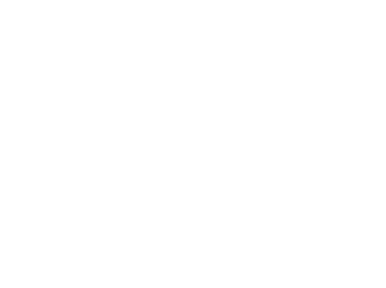

<!-- 

-->



#  在 .NET 微服务中应用 Dapr：从配置到实践

---

<!-- 
header: '在 .NET 微服务中应用 Dapr：从配置到实践'
-->

## 目录
1. **什么是 Dapr?**
2. **为什么选择 Dapr + .NET?**
3. **演示项目概述**
4. **配置与开发流程**
5. **Dapr 的核心优势**
6. **案例对比**
7. **总结与 Q&A**

---

<!--
header: '在 .NET 微服务中应用 Dapr：从配置到实践 - 1. 什么是 Dapr?'
-->

## 1. 什么是 Dapr?

Dapr (Distributed Application Runtime) 是一个开源、可移植的微服务运行时，提供分布式系统构建块：
- 服务调用（Service-to-service invocation）
- 状态管理（State management）
- 发布订阅（Pub/Sub）
- 可观测性（Observability）
- 密钥管理（Secrets）
- 等 10+ 种能力...

---

<!--
header: '在 .NET 微服务中应用 Dapr：从配置到实践 - 2. 为什么选择 Dapr + .NET?'
-->

## 2. 为什么选择 Dapr + .NET?

### 完美组合
- **.NET 生态**：ASP.NET Core 的天然微服务支持
- **Dapr 加持**：解耦基础设施，专注业务逻辑
- **开发效率**：减少 40%+ 的样板代码（示例后文演示）

### 典型场景
- 多语言服务混合部署
- 复杂事件驱动架构
- 需要快速实现弹性模式（重试/熔断）

---

<!--
header: '在 .NET 微服务中应用 Dapr：从配置到实践 - 3. 演示项目概述'
-->

## 3. 演示项目概述

### 项目结构
```bash
├── OrderService (ASP.NET Core)
├── InventoryService (ASP.NET Core)
├── docker-compose.yml
└── components/  # Dapr 组件配置
    ├── redis-pubsub.yaml
    ├── redis-state.yaml
    └── zipkin.yaml
```

---

### 功能流程
- 用户提交订单 → `OrderService`
- 订单服务通过 Dapr 调用 `InventoryService` 检查库存
- 库存更新通过 `Pub/Sub` 异步通知
- 使用 Dapr 状态管理持久化数据

---

<!--
header: '在 .NET 微服务中应用 Dapr：从配置到实践 - 4. 配置与开发流程'
-->

## 4. 配置与开发流程（实战演示）

### 步骤 1：安装 Dapr
```bash
# 使用 Docker 快速初始化
dapr init --runtime-version=1.10.0
```

### 步骤 2：添加 .NET SDK 包
```bash
dotnet add package Dapr.AspNetCore
dotnet add package Dapr.Client
```

### 步骤 3：服务注册（Program.cs）
```csharp
var builder = WebApplication.CreateBuilder(args);
builder.Services.AddControllers().AddDapr(); // 关键注入
```

---

### 步骤 4：实现服务调用
```csharp
// OrderController.cs
[HttpPost]
public async Task<IActionResult> CreateOrder([FromBody] Order order)
{
    // 通过 Dapr Sidecar 调用库存服务
    var result = await _daprClient.InvokeMethodAsync<InventoryRequest, InventoryResponse>(
        HttpMethod.Post, 
        "inventoryservice", 
        "api/inventory/check",
        new InventoryRequest { ProductId = order.ProductId }
    );    
    // 处理业务逻辑...
}
```

### 步骤 5：运行服务
``` bash
# 启动 OrderService 并附加 Dapr Sidecar
dapr run --app-id orderservice --app-port 5000 dotnet run
```

---

<!--
header: '在 .NET 微服务中应用 Dapr：从配置到实践 - 5. Dapr 的核心优势'
-->

## 5. Dapr 的核心优势
| 传统实现 | Dapr 实现 | 收益 |
| --- | --- | --- |
| 需要手动实现服务发现 | 自动服务发现 | 减少 30% 网络层代码 |
| 直接依赖 Redis/Kafka | 通过组件抽象 | 基础设施切换零代码修改 |
| 自行实现重试/熔断 | 内置弹性策略 | 提升系统稳定性 |
| 分散的监控配置 | 统一可观测性出口 | 调试效率提升 50%+ |

---

<!--
header: '在 .NET 微服务中应用 Dapr：从配置到实践 - 6. 案例对比'
-->

## 6. 案例对比：库存扣减逻辑

### 传统实现
```csharp
// 直接依赖 Redis 客户端
var redis = ConnectionMultiplexer.Connect("localhost");
var db = redis.GetDatabase();
db.StringSet(orderId, "pending");
```

### Dapr 实现
```csharp
// 通过 Dapr 状态管理抽象
await _daprClient.SaveStateAsync(
    "statestore", 
    orderId.ToString(), 
    "pending"
);
```

---

### 优势体现
- 无需管理连接字符串（通过组件配置）
- 持多状态存储无缝切换（Redis/CosmosDB/SQLServer...）
- 自动实现并发控制（ETag）

---

<!--
header: '在 .NET 微服务中应用 Dapr：从配置到实践 - 7. 总结与 Q&A'
-->

## 7. 总结与 Q&A

### 关键收获
- ✅ 通过 Sidecar 模式实现业务与基础设施解耦
- ✅ 使用标准化构建块加速分布式系统开发
- ✅ 可移植性：轻松切换云平台/本地环境

### 后续建议
- 探索 Dapr 的 Actor 模型
- 尝试结合 Kubernetes 部署
- 监控指标集成（Prometheus + Grafana）

---

### 常见问题预设：
- Dapr 的性能开销如何? → Sidecar 模式增加约 2ms 延迟，可通过 gRPC 优化
- 是否必须使用 Docker? → 开发环境推荐，生产环境支持 K8s/VM 等
- 如何调试 Dapr 应用? → 使用 Dapr Dashboard 和 Zipkin 追踪
