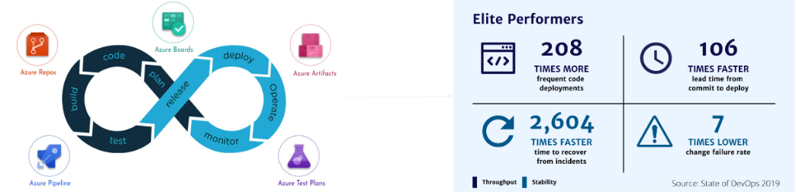

# **落地 DORA 指标** Part 1

> 先做决定, 再做实现

---

# **什么是 DORA 指标**

> 通过观测开发流程的速度与稳定性来评估开发团队的表现.

## 

---

# **DORA 指标里的变数**

 它不是一个简单明确的指标, 它有很多变数, 受到如下列因素的影响

 

- 不同的服务性质或产品运营战略.
- 不同的团队规模.
- 不同的项目资源.
- 不同的项目管理风格.

---

# **指标的定义**

- 部署频率 (DF): 每个周期的部署次数.
- 变更交付周期 (LTFC): 首次代码提交到部署之间的时间. 
- 变更失败率 (CFR): 部署后发现问题的次数.
- 服务恢复速度 (MTTR): 发现问题到修复完成之间的时间. 

---

# **我们的指标的定义**

`如何定义一次部署`

- 面向终端用户, 发布到生产环境的前台?
- 面向终端用户, 发布到生产环境的中台?
- 面向终端用户, 发布到生产环境的资源变更?
- 面向开发人员, 发布的开发包?

---

# **我们的指标的定义**

`如何定义首次代码提交`

- feature 工作项从 new 变为 active 的时间点?
- feature 相关的代码首次 push 时间点?
- feature 相关的代码首次 commit 时间点?

---

# **我们的指标的定义**

`如何定义变更失败`

- 服务完全离线?
- 服务功能部分失效?
- 服务出现不影响正常使用的小问题?

---

# 盲目追求 DORA 指标可能导致的后果
- 强调产出而忽略文化与协作, 团队成员互相催促导致紧张甚至敌对情绪.
- 时间精力出现浪费, 频繁的开发和部署无关紧要的更新.
- 代码质量逐渐变低导致技术债堆积, 补丁变多可维护性降低, 综合安全性下降.
- 由面向客户/功能开发渐渐偏向面向老板/指标开发.

---

# Thank you

