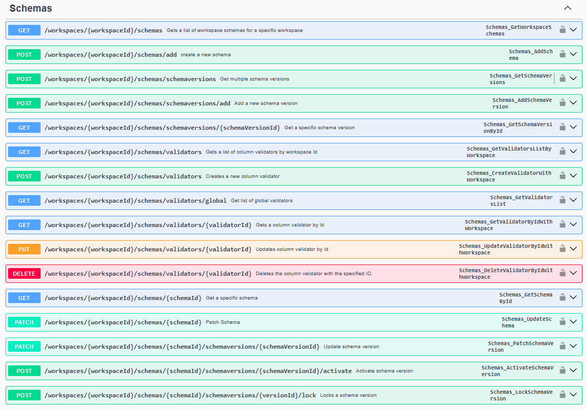
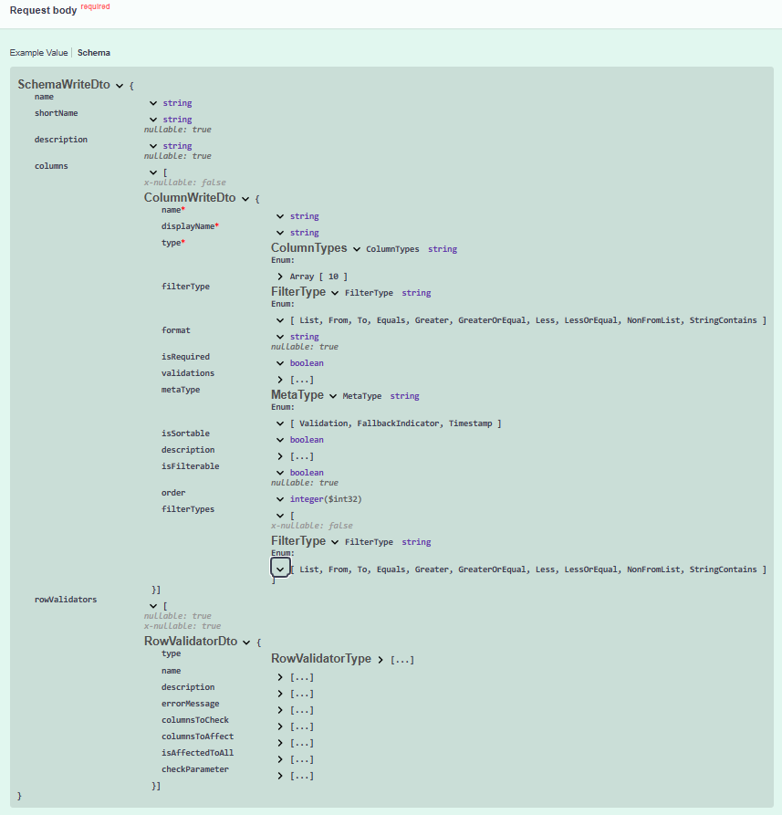

# **Stop Coding API Access by Hand**

 _Automating API Client/SDK Generation with Swagger/OpenAPI_

<!--
Presenter notes:
- Time management, time speak on each agenda
- Interaction with audience
- Realworld examples
- Restate the benefits for the audience
-->

---

<!-- 
header: 'Stop Coding API Access by Hand'
-->

## **Agenda**

1. **The `PITFALLS` of hand coding API access**
2. **The `MAGIC` of API client generation**
3. **The `BATTLE` between hand-crafted and machine-generated**
4. **The `VICTORY` is that business got generated**
5. **The `DOUBT` you still got**

---

## **The `PITFALLS` of hand coding API access**

- **⌛ Time-Consuming & Repetitive**
- **❌ Error-Prone & Hard to Maintain**
- **😎 Inconsistent & Varied Styles**
- **⚠️ Lack of Type Safety**
- **👻 Unit Test Nightmare**

<!--
- Time-Consuming & Repetitive
- - Reading API docs with raw eyes
- - Coding for the `urls`, `parameters`, `payloads`, `object schemas`
- - Coding for operating `HttpClient`, `HttpRequestMessage`, `HttpResponseMessage` and serialization, and error handling

- Error-Prone & Hard to Maintain
- - Mis-reading API docs
- - Updating code for every API update
- - Could be difficult to identity all the API updates
 
- Inconsistent & Varied Styles
- - Code written by different developers or for different projects can vary significantly in style
- - Error handling logic, logging mechanisms, etc., become hard to standardize
- - Not easy to describe an endpoint to others

- Lack of Type Safety
- - Directly handling string or binary content, then manually deserializing, sacrifices compile-time type checking
- - Relying on `dynamic` or `JObject` compromises type safety and refactoring ease

- Unit Test Nightmare
- - Multiple test cases for each API endpoint
- - Preparing for lot of test data

-->

---

<!-- header: The `PITFALLS` of hand coding API access -->



---



---

<!-- 
header: 'Stop Coding API Access by Hand'
-->

## **The `MAGIC` of API client generation**

- **⏩ Tremendously Increased Development Efficiency**
- **♻️ Reduced Human Error**
- **🙂 Simplified Maintenance**
- **🍻 Consistent Code Style**
- **✅ Improved Testability**

---

## **The `BATTLE` between hand-crafted and machine-generated**

Hand-crafted API Client
```csharp
public class ManualApiClient {
  public async Task<UserDto> GetUserById(string userId) {
    var request = new HttpRequestMessage(HttpMethod.Get, $"api/users/{userId}");
    // ... set Headers, Accept, etc. ...
    var response = await _httpClient.SendAsync(request);
    response.EnsureSuccessStatusCode(); // Or manual check
    var json = await response.Content.ReadAsStringAsync();
    return JsonSerializer.Deserialize<UserDto>(json, _options);
  }

  public record UserDto(	
    [JsonPropertyName("id")] string Id,
    [JsonPropertyName("name")] string Name,
    [JsonPropertyName("email")] string Email
  )
}
```

---

## **The `BATTLE` between hand-crafted and machine-generated**

machine-generated API Client

```csharp
var apiClient = new GeneratedApiClient();
var user = await apiClient.GetUserById(userId);
```

---

## **The `VICTORY` is that business got generated**

 |   |   |   |
 |---|---|---|
 |Aspect|Manual Code|Generated Code|
 |**Code Volume**|More (HTTP setup, serialization, error handling etc.)|Minimal (single line call)|
 |**Type Safety**|Potentially weak (relies on manual conversion)|Strong (clear method signatures & return types)|
 |**Error Handling**|Manual StatusCode checks, throwing exceptions, etc.|Typically has standardized exception handling built-in|

---

## **The `VICTORY` is that business got generated**

 |   |   |   |
 |---|---|---|
 |Aspect|Manual Code|Generated Code|
 |**API Change Response**|Painful, requires manual edits in multiple places|Simple, regenerate the client|
 |**Dev. Efficiency**|Low|High|
 |**Error Likelihood**|High (typos, logical errors)|Low (based on specification)|
 |**Maintainability**|Poor|Good|
 |**Distribution**|Manual copying|To package feeds|
 
---

## **The `VICTORY` is that business got generated**

The Project/App equipped with generated (besides 3rd party) API Client:
- OVD - all the access to both internal (4) & external (5) APIs
- DataWorkbench - more than 15 internal APIs

---

## **The `DOUBT` you still got**


---

## **Thank You**