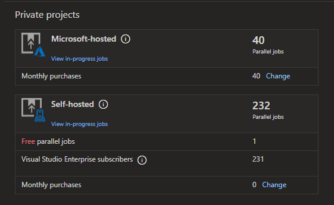
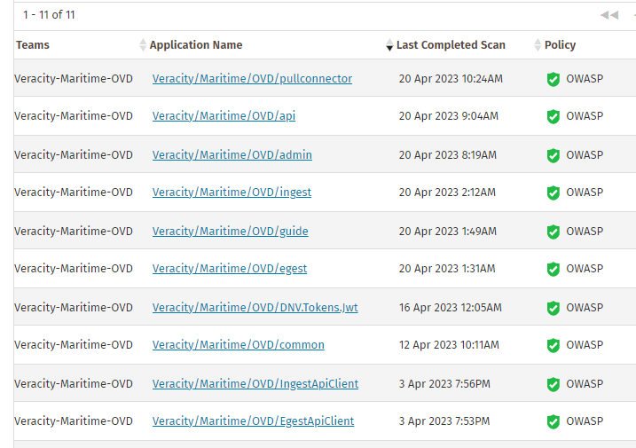
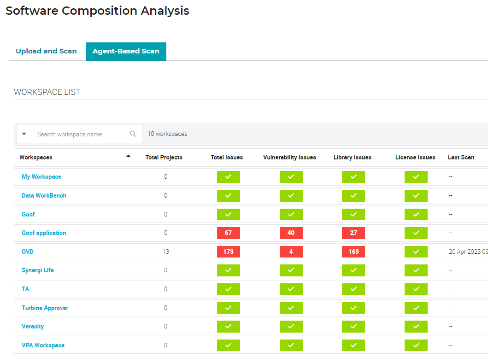

# <!--fit--> **Productivity**

- Improvement to Coding
- Improvement to DevOps
- Improvement to Security

---

<!-- header: `OVD` `DW: DataWorkbench` `VAP` `TA: Turbine Approver` `PLA: Veracity Platform Analytics` `AFI: Alternvative Fuel Insight` `WI: Wind Inspector` `etc.` -->

# **Productivity Improvement to Coding**

## Initialized/Assisted `>7` projects to adapt Solution Packages.

- **`Accelerated`** Veracity authentication implementation
- **`Reduced`** the learning cost/curve of `OAuth/OIDC protocal`/`Token caching`/`Caching security`.
- **`Saved`** `>3` days for each Backend developer.

---

<!-- header: '' -->

# **Productivity Improvement to DevOps**

## Wait less and do more.

- **`Enhanced`** and **`Dockerized`** self-hosted agent with pre-setup tools/caching.
- **`Parallelized`** pipeline jobs for OVD.
- **`Automated`** Data Validator Schema syncing process

---

<!-- header: `OVD` `DW: DataWorkbench` `VAP` `Marketplace` `PLA: Veracity Platform Analytics` -->

# **Productivity Improvement to Security**

- `Discovered` and `resolved` token security issue for Data Workbench.
- `Applied` Veracode SCA and SAST for OVD with best practises.
- `Assisted` Veracode onboarding for multiple teams/projects.

---

> OVD is currently the `leading` project on Veracode

- Scan 'My Code' only and correctly, no more no less.
- Identify all false positives and fix the rest.

---

> OVD is currently the `only active` project on Veracode Agent-Based SCA

- Scan SBOM files only.

---

# Thank you